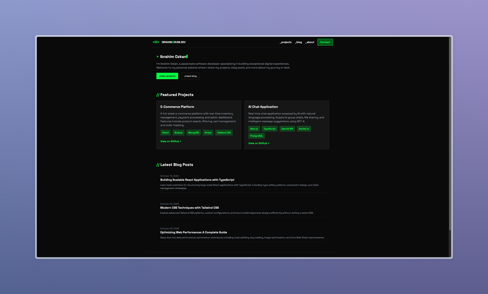
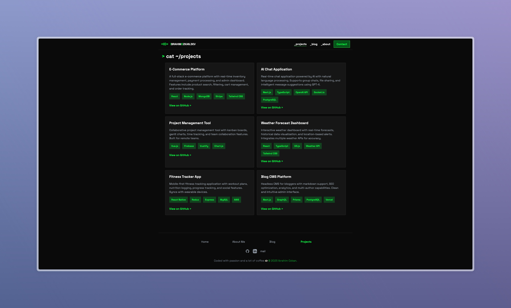
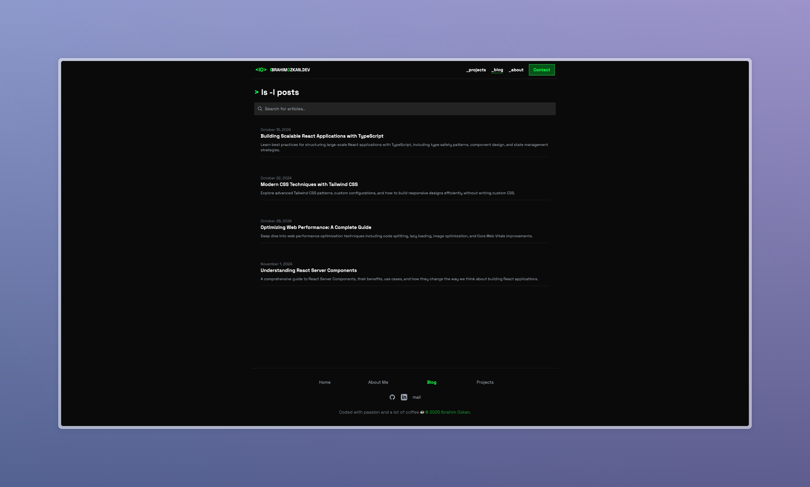
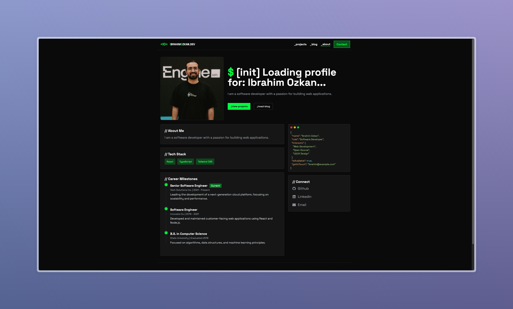

# ibrahimozkan.dev 🚀

My personal portfolio website that I built during a random burst of inspiration (read: boredom). What started as "let me just mess around with React for a bit" turned into a full-fledged portfolio site.

## ✨ What I Built

- **Responsive Design** - Looks good on your phone, tablet, or that massive monitor you have
- **Blog System** - Write posts in Markdown because I'm lazy and Markdown is easy
- **Project Showcase** - All my cool projects in one place
- **Dark Theme** - Because dark mode is superior (fight me)
- **Contact Form** - So you can actually reach out to me

## 🛠️ Tech Stack

Built with some awesome technologies:

- **[React 19](https://react.dev/)** - The UI library we all know and love
- **[TypeScript](https://www.typescriptlang.org/)** - JavaScript, but make it type-safe
- **[Vite 7](https://vite.dev/)** - Super fast build tool and dev server
- **[Tailwind CSS 4](https://tailwindcss.com/)** - Utility-first CSS framework
- **[React Router 7](https://reactrouter.com/)** - Client-side routing
- **[React Markdown](https://github.com/remarkjs/react-markdown)** - Markdown rendering with GFM support
- **[React Syntax Highlighter](https://github.com/react-syntax-highlighter/react-syntax-highlighter)** - Beautiful code blocks
- **[React Icons](https://react-icons.github.io/react-icons/)** - Icon library
- **[ESLint](https://eslint.org/)** & **[Prettier](https://prettier.io/)** - Keep my code clean and consistent

## 🚀 Getting Started

Want to run this locally? Here's how:

### Prerequisites

- Node.js (16 or higher)
- npm or yarn (I use npm, but you do you)

### Installation

1. **Clone this repo:**

```bash
git clone https://github.com/ibrahimozkn/ibrahimozkan_dev.git
cd ibrahimozkan_dev
```

2. **Install dependencies:**

```bash
npm install
```

3. **Fire up the dev server:**

```bash
npm run dev
```

4. **Open your browser:**

Navigate to `http://localhost:5173` and you should see the site running!

## Screenshots

### Home Page


_Landing page with hero section and featured content_

### Projects


_Showcase of all my projects with tech stacks_

### Blog


_Blog posts listing with previews_

### About


_My professional journey and background_

## 📜 Available Scripts

Here's what you can do:

- `npm run dev` - Start development server with hot reload
- `npm run build` - Build for production
- `npm run preview` - Preview production build locally
- `npm run lint` - Check for code issues
- `npm run format` - Auto-format code with Prettier
- `npm run format:check` - Check formatting without making changes

## 📁 Project Structure

```
src/
├── pages/              # All the main pages
│   ├── Home.tsx        # Landing page
│   ├── About.tsx       # About me
│   ├── Projects.tsx    # Projects showcase
│   ├── Blog.tsx        # Blog posts listing
│   ├── BlogPost.tsx    # Individual blog post
│   └── Contact.tsx     # Contact form
├── components/         # Reusable components
│   ├── layout/         # Layout components (Navbar, Footer, etc.)
│   ├── blog/           # Blog-related components
│   ├── project/        # Project-related components
│   ├── form/           # Form components
│   ├── social/         # Social media links
│   └── common/         # Shared components
├── assets/
│   ├── data.json       # Blog posts and projects data
│   └── blog_posts/     # Markdown blog posts
├── lib/                # Utility libraries
├── utils/              # Helper functions
└── types/              # TypeScript definitions
```

## 🎨 Customization

### Adding Blog Posts

1. Create a new `.md` file in `src/assets/blog_posts/`
2. Add the post metadata to `src/assets/data.json`
3. Done! The blog system will pick it up automatically

### Adding Projects

Just update the `projects` array in `src/assets/data.json` with your project details.

## Deployment

Build it:

```bash
npm run build
```

The `dist/` folder contains your production-ready site. Deploy it anywhere.

## 🤔 Why I Built This

Honestly? I was bored one weekend and thought "I should probably have a proper portfolio site instead of just a GitHub profile." What started as a simple landing page evolved into this full-featured portfolio with a blog, project showcase, and all the bells and whistles.

It's also a great excuse to play with React and learn new things.
